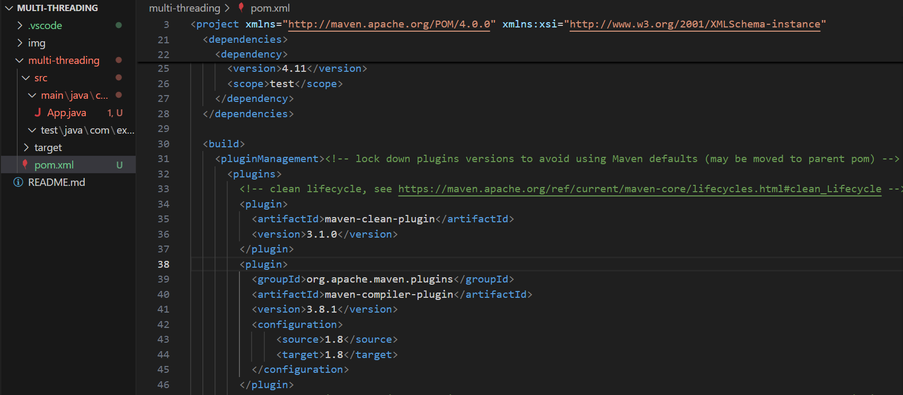
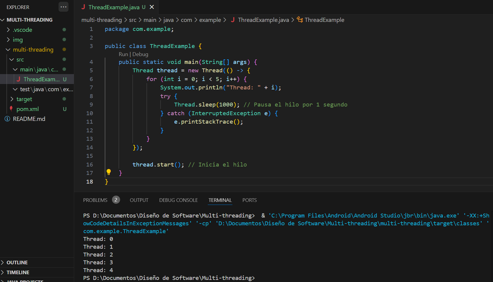
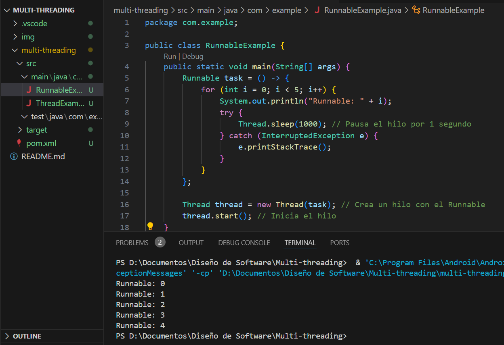
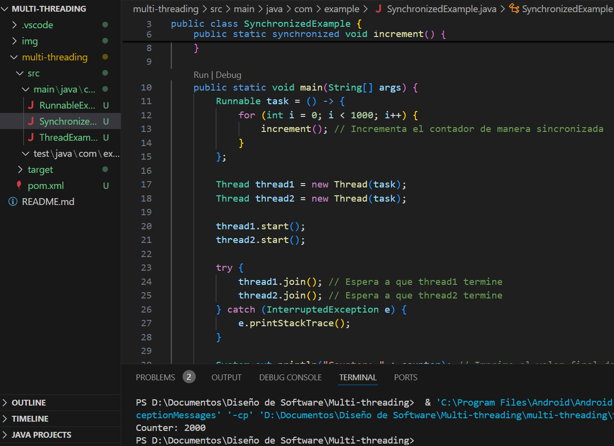
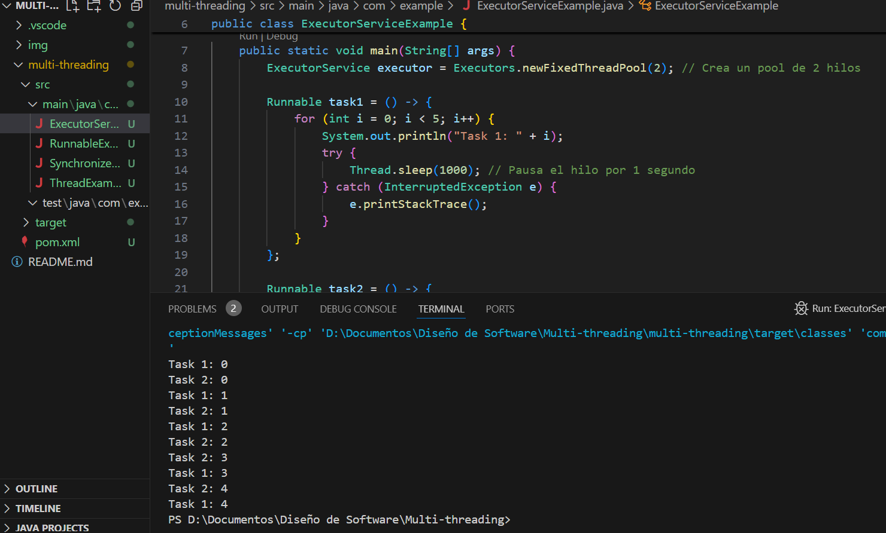
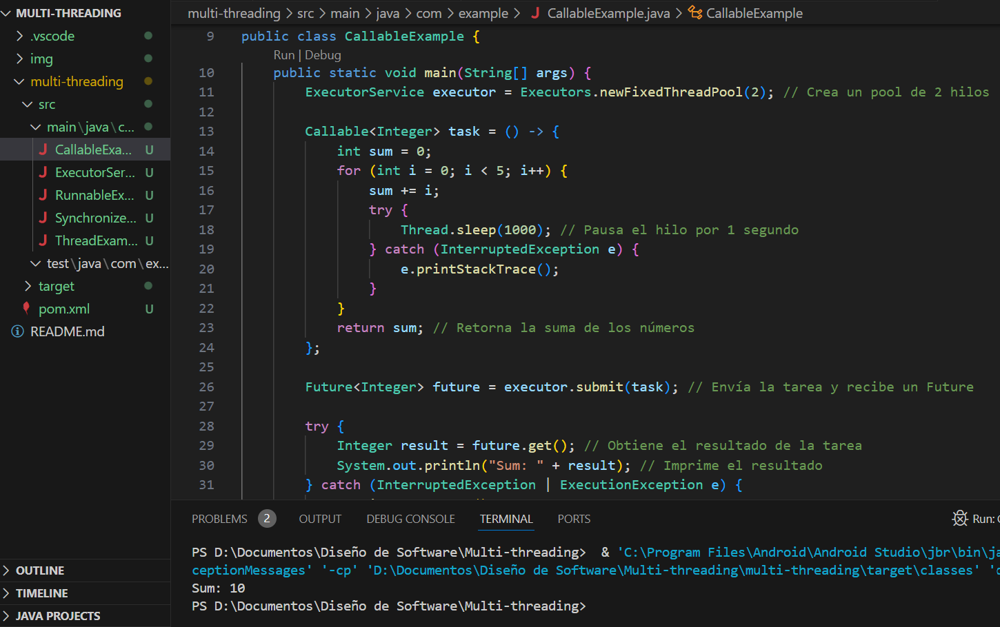
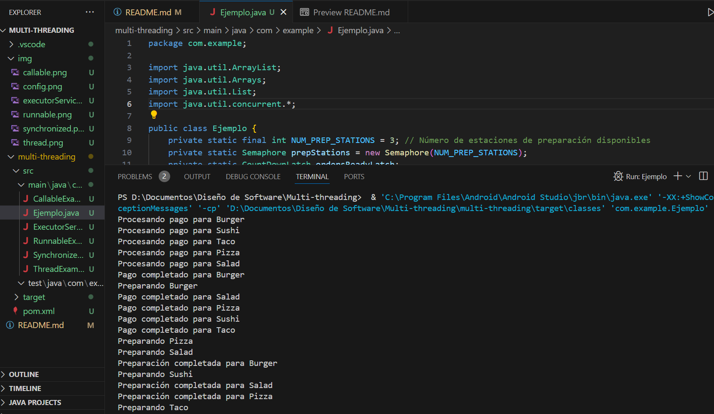

# Multi-threading
## 1. Adaptacion del entorno:

Añadimos el plugin maven-compiler-plugi.

## 2. Creación de hilos:

Añadimos los hilos de Thread, Runnable, synchronized, ExecutorService, Callable, y Future.

### Thread:

### Runnable:

### Synchronized:

### ExecutorService:

### Callable y Future:

## 3.1 Contexto: 

Pedidos de Comida en un restaurante, donde varias partes del proceso se ejecutan en paralelo (procesamiento concurrente de pedidos y pagos y preparación de los alimentos).

## 3.2 Operadores usados:

1. `ExecutorService` : Gestiona un pool de hilos para ejecutar las tareas.
2. `Callable y Future` : Cada pedido de comida tiene un hilo que representa su preparación, y estos hilos retornarán el tiempo de espera estimado.
3. `Runnable` : Se utiliza para el procesamiento del pago.
4. `synchronized` : Asegura que solo un hilo pueda acceder al método de actualización de inventario de ingredientes a la vez.
5. `CountDownLatch` : Garantiza que los pedidos no se envíen hasta que todos los componentes estén listos.
6. `Semaphore` : Controla el acceso al número limitado de estaciones de preparación de comida.

## 3.3 Salida: 

